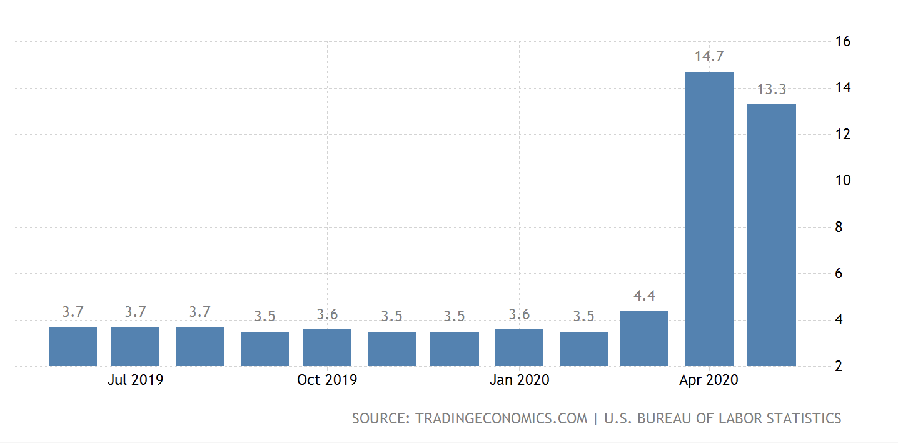

Analysis
=======================================================================

```{r setup, include=FALSE}
library(flexdashboard)
library(tidyverse)
library(ggthemes)

library(readr)
# archived data
us_counties <- read_csv("us-counties.csv")
us_states <- read_csv("us-states.csv")
us <- read_csv("us.csv")

# live data
us_counties_live <- read_csv("live/us-counties.csv")
us_states_live <- read_csv("live/us-states.csv")
us_live <- read_csv("live/us.csv")

florida_only <- us_states_live %>% 
                     filter(date > "2020-03-01",
                      state == "Florida")

```

Row
---------------------------------------------------------------------------------
### Total Confirmed Positive (Florida)

```{r n_positive_fl}

n_positive_fl <- florida_only$cases
valueBox(n_positive_fl, icon = "fas fa-search-plus", color = "#fa7404")

```

### Total Confirmed Deaths (Florida)

```{r n_deaths_fl}

n_deaths_fl <- florida_only$deaths
valueBox(n_deaths_fl, icon = "fas fa-skull-crossbones", color = "#fa7408")

```

### Total Confirmed Positive (U.S.)

```{r n_positive_US}

n_positive_US <- us_live$cases
valueBox(n_positive_US, icon = "fas fa-search-plus", color = "#fa3404")

```

### Total Confirmed Deaths (U.S.)

```{r n_deaths_US}

n_deaths_US <- us_live$deaths
valueBox(n_deaths_US, icon = "fas fa-skull-crossbones", color = "#fa3408")

```

Row {data-width=650}
-----------------------------------------------------------------------
### Number of Cases since March 1st (Florida)

```{r}

ggplot(data = filter(us_states,
                     date > "2020-03-01"
                     )) +
  
  labs(title = "Cumulative # of Cases",
        x = "Date, (starting at March 1st)",
        y = "Number of Cases",
        colour = "") +

  geom_line(data = filter(us_states, state == "Florida"),
            aes(x = date, y = cases, color = "Florida")) +
  
  geom_line(data = filter(us_counties, county == "Miami-Dade"),
            aes(x = date, y = cases, color = "Miami-Dade")) +
  
  geom_line(data = filter(us_counties, county == "Broward"),
            aes(x = date, y = cases, color = "Broward")) +
  

  theme_few()
   
  

```

### Number of Cases since March 1st (Entire U.S.)

```{r}

ggplot(data = filter(us,
                     date > "2020-03-01"
                     )) +
  
  labs(title = "Cumulative Number of Cases and Deaths",
        x = "Date, (starting at March 1st)",
        y = "Number",
        colour = "") +

  geom_line(aes(x = date, y = cases, color = "Cases")) +
  
  geom_line(aes(x = date, y = deaths, color = "Deaths")) +

  theme_few()
   

```

Row {data-width=650}
-----------------------------------------------------------------------

### What are the symptoms?


### Unemployment spiked (tradingeconomics.com)




Raw Data
=======================================================================

Column {data-width=650}
-----------------------------------------------------------------------

### U.S. Summary
```{r}

DT::datatable(data = filter(us,
                     date > "2020-03-01"))
  
```

### Florida Summary
```{r}

DT::datatable(data = filter(us_states,
                     date > "2020-03-01",
                    state == "Florida"))
  
```


Column {data-width=650}
-----------------------------------------------------------------------
### Counties in Florida

```{r}

DT::datatable(data = filter(us_counties,
                     date > "2020-03-01",
                     state == "Florida"))
  
```

